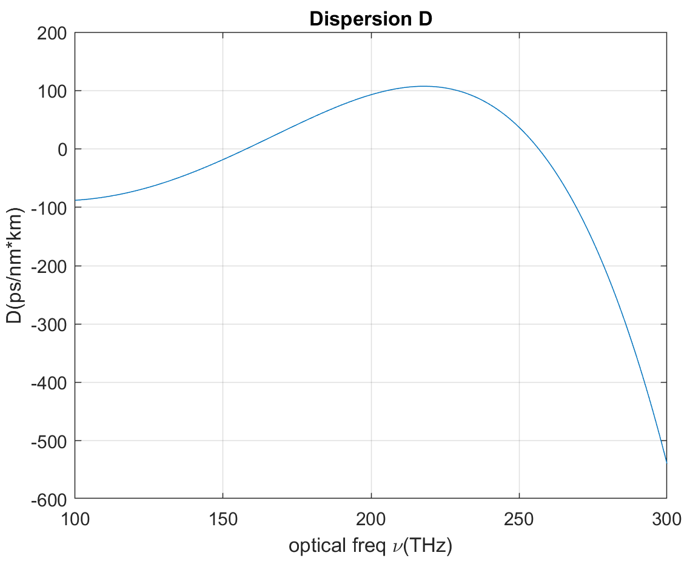
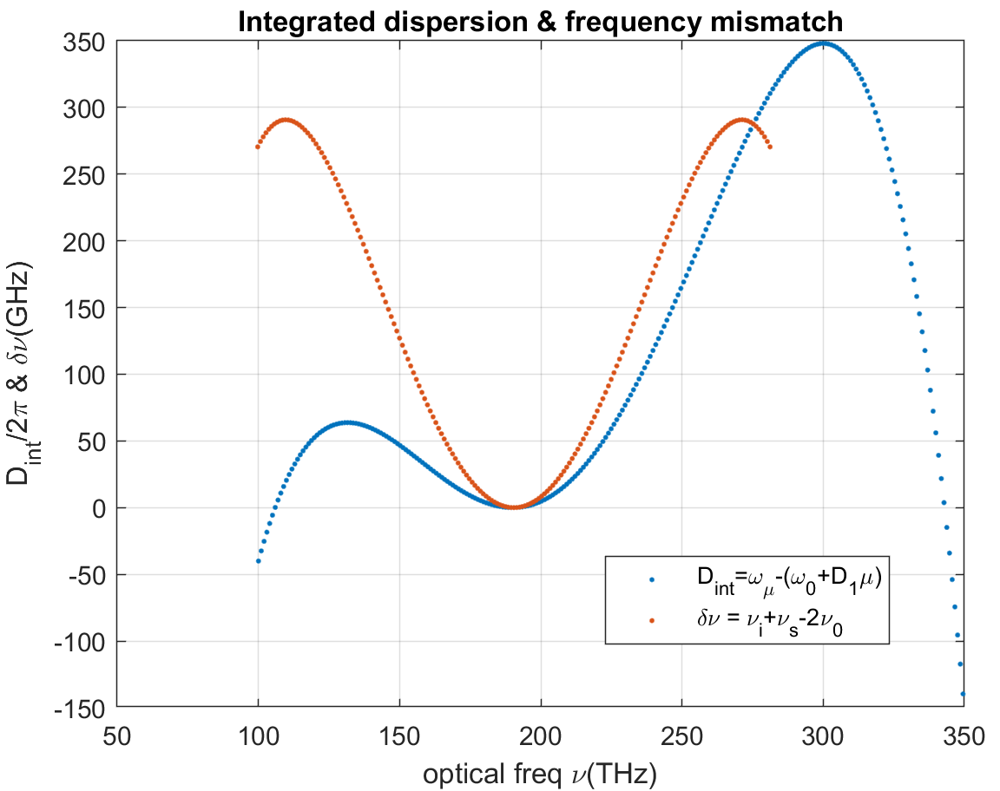

# Waveguide Photonics Toolbox

This toolbox includes a [waveguide mode](http://photonics.umd.edu/software/wgmodes/) solver developed by the research group led by Professor Thomas E. Murphy at The University of Maryland as the core module, a module of the calculation of roughness induced scattering loss and resonance splitting, a module of the dispersion property calculation for nonlinear optics. 

## Full vector waveguide mode solver

Some functions are added to the original `modesolver` module to mesh the commonly used  or user-customized waveguide geometries , such as rectangular, fiber and D shape (`wg-photonics-toolbox/modesolver/tool_added`). Examples based on these added mesh functions can be found in `wg-photonics-toolbox/modesolver/examples_added`. The input takes the waveguide geometry and wavelength information and the output gives the mode profile and waveguide surface coordinates info. The index of the waveguide surface coordinates `iedges` is useful in the scattering-splitting calculation.

#### input

`% geometry`

`
width = 2.5;        % waveguide width`

`
h_co = 0.73;        % Core thickness`

`
h_cl = 1.0;         % Cladding thichness`

`
side = 1.0;         % Space on side`

`
dx = 20e-3;         % grid size (horizontal)`

`
dy = 10e-3;         % grid size (vertical)`

`% wavelength`

`
n_cl = 1.4431;      % Cladding index`

`
n_co = 1.9963;      % Core index`

`
lambda = 1.55;      % vacuum wavelength`

`
nmodes = 1;         % number of mode to compute`

`
L = 2*pi*11.8e3;    % waveguide length (um)`

#### output

`[x,y,xc,yc,nx,ny,eps,edges,iedges] = waveguidemesh_rect([n_cl,n_co,n_cl],[h_cl,h_co,h_cl],width/2,side,dx,dy);`

`[Hx,Hy,neff] = wgmodes(lambda,n_co,nmodes,dx,dy,eps,'0000');`

## Scattering-splitting calculation module

The module takes in two major inputs. One is the mode profile solved by `modesolver`with waveguide geometry input and wavelength input. The mode solver outputs the mode profile and the index of the edges The other is the roughness information specified by a structure variable that consists of:

- `roughness.surfaces={1,3}` - cell list of identifiers of  the waveguides surfaces
  - `1234` in rect waveguide points to north, south, eat, west surfaces
  - `12` in D-shape points to north, south surfaces
- `roughness.Lc = {[10e-3,10e-3], [120e-3]}` - cell list of lists of correlation lengths. **Length of the list, either 1 or 2, indicates the dimension of the roughness, either 1D or 2D.**
- `roughness.sigma={0.5e-3,2.5e-3}` - cell list of RMS roughness for each surface.

About the dimension of the roughness, 1D roughness applies well for sidewall: $R(u)=\langle f(z)f(z+u) \rangle=\sigma^2 e^{-u/L_c}$. For top surface of rect waveguide, 2D roughness is more accurate a description: $R(u_x,u_z)=\langle f(x,z)f(x+u_x,z+u_z) \rangle=\sigma^2 e^{-(u_x+u_z)/L_c}$.

## Dispersion calculation module

With only input of neff at different frequencies, it computes the group index ng and the dispersion D. Given your resonator roundtrip length L, it computes FSR at different frequencies.

With a SiN waveguide with 2000 nm by 770 nm and SiO2 cladding, the pump laser is at 190 THz and it plots the frequency matching
and the integrated dispersion Dint. Open `test_dispersion_calc.m` which uses `dispersion_calc.m` for dispersion calculation and then uses `get_Dint.m` to calculated integrated dispersion and uses `freq_mismatch.m` to calculate the frequency mismatch between signal, idler and pump.

 

## How to use

Add the full path into MATLAB search path by running `add_path.m`. Start from `test_scripts`.

## Issues

- **dispersion calculation is inaccurate.**